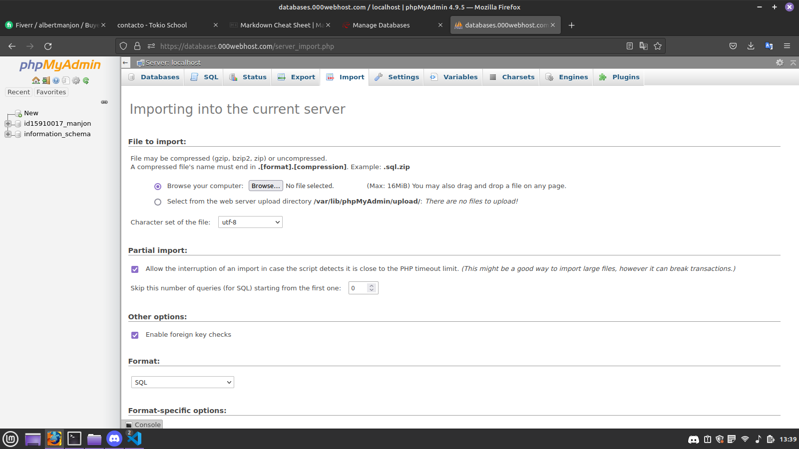

# Documentacion 

### Instalar paquetes de composer
```php
composer install
```
### Crear base de datos
>Crear tabla:
```sql
CREATE DATABASE ProyectoTokioSchool;
```
>Entrar en la base de datos::
```sql
use ProyectoTokioSchool;
```
>Crear tabla ususarios:
```sql

    CREATE TABLE users (
        id  INT unsigned NOT NULL AUTO_INCREMENT,
        name VARCHAR(255),
        last_name VARCHAR(255),
        email VARCHAR(255) UNIQUE,
        password TEXT,
        PRIMARY KEY (id)
    )
```
---

# o subir archivo a phpmyadmin:
>
> Nos dirigimos a **IMPORTAR**
> 
> Damos click a **browser** y buscaremos el archivo **database.sql**
>
> A continuacion le daremos al boton de **GO**

---
# Cambiar parametros de la base de datos
>/config/Settings.php

```php

 define('DB_SETTINGS', array(
    'HOST'      => 'localhost:3306',
    'USER'      => 'root',
    'PASSWORD'  => 'root',
    'DATABASE'  => 'ProyectoTokioSchool'
  ));

```
---
# Iniciar proyecto en Local

>php -S localhost:9000 -t ./public
---
# Author
> Albert.J.Manjon - [Contact me through linkedin](https://www.linkedin.com/in/albert-jurado-manjon-0878b2198/)
---
# License
>Licensed under the MIT License.
